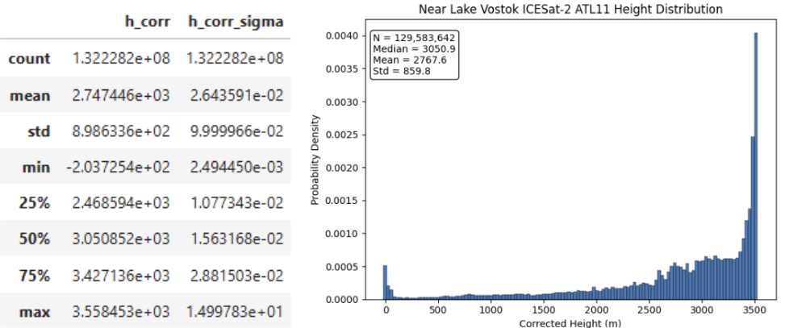

## Ashley and Cameron
* Data sources should be open and accessible. 
    * Wilkinson, M., Dumontier, M., Aalbersberg, I. et al. The FAIR Guiding Principles for scientific data management and stewardship. Sci Data 3, 160018 (2016). https://doi.org/10.1038/sdata.2016.18
* Check your data for gaps, missing values, outliers, and other inconsistencies. Understand the units, uncertainties, and statistical distribution of the data. 
<figure>
  
  <figcaption><strong>Figure 1:</strong> Example of data distribution and statistical characteristics for our subglacial lake identification project using satellite altimeter data.</figcaption>
</figure>

* Document your data sources and any processing steps as you work with it to keep track of changes or make your processing more accessible to future users.
* Reduce dimensionality using techniques like filtering or PCA. Carefully consider the question you are trying to answer when selecting parameters and dimensions. 
