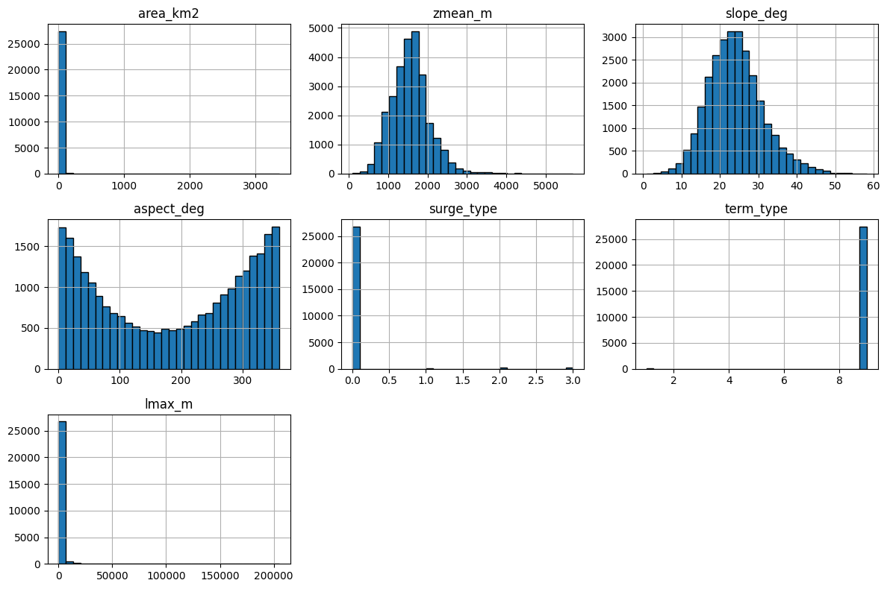
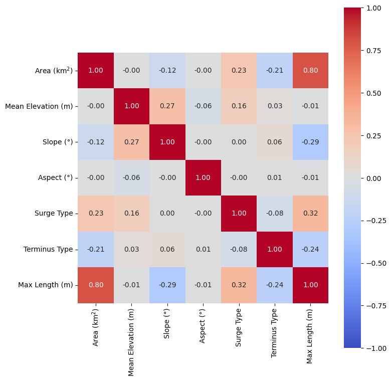
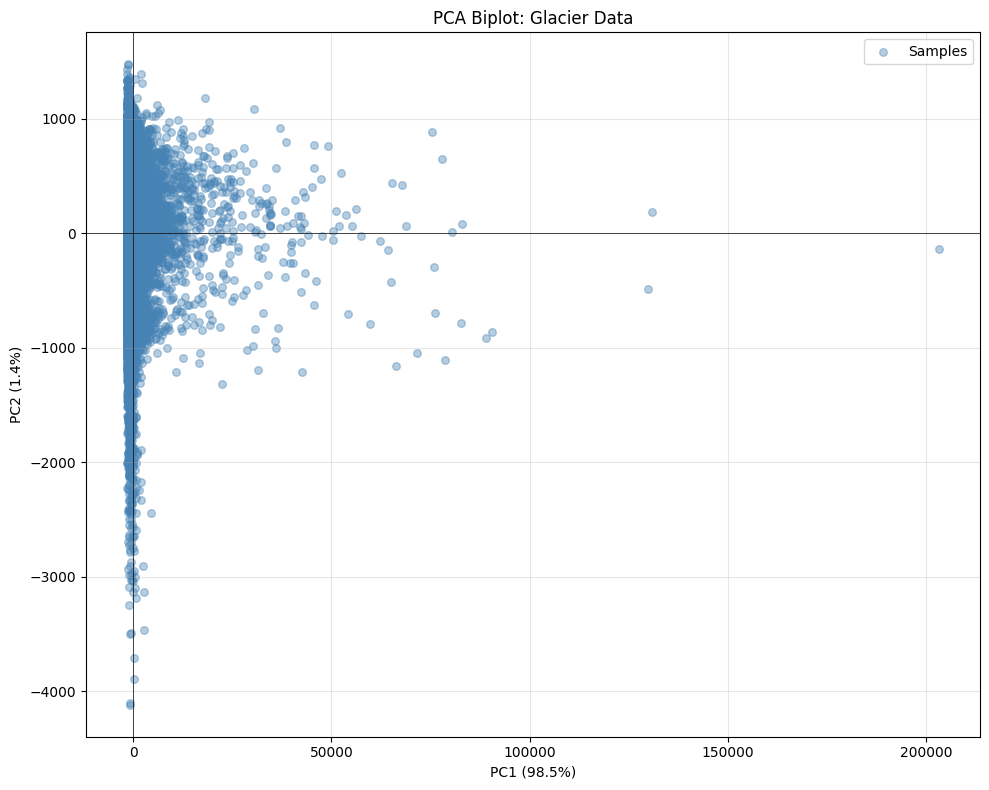

# PCA on glacier data

**Authors:** Manali and David  
**Date:** January 30, 2026  
**Course:** ESS 569 - Machine Learning in Geosciences

## Objective 
Explore the correlation between measurements of a group of glaciers from Alaska using Principal Component Analysis (PCA). We analyze multiple glacier attributes including area, mean elevation, slope, aspect, surge type, terminus type, and maximum length to understand which variables drive the most variation in the dataset.

## Dataset
The data comes from the Randolph Glacier Inventory (RGI version 7.0) for the Alaska region, containing various morphological and geometric properties of glaciers.

## Data selection

We decided to drop some variables such as terminus and surge type since they are categorical and not direct measurements. We also got rid of columns that contained strings and kept only the mean elevation instead of the the min and max elevation measurements.

| Variable | Description | Units |
|----------|-------------|-------|
| `area_km2` | Total glacier area | km² |
| `zmean_m` | Mean elevation | m |
| `slope_deg` | Average surface slope | degrees |
| `aspect_deg` | Dominant aspect (orientation) | degrees |
| `surge_type` | Surge behavior classification | categorical |
| `term_type` | Terminus type (land/marine terminating) | categorical |
| `lmax_m` | Maximum glacier length | m |

## Correlation analysis

We calculated the correlation coefficients between several variables in the dataset that we were interested in and found that the highest correlation was between 'Max Length' and 'Area'. Upon performing PCA we found that 98% of the variance is explained by the first Principal Component which is 'Max Length' and the second is driven by 'Mean Elevation' though this contributes weakly to the variance in comparison.

We find that the length of the glacier is weakly and negatively correlated with the slope of the glaciers, though this does not seem to contribute much to the variance.

## PCA Results

### Explained Variance

The PCA revealed an extremely strong dominance of the first principal component:

| Component | Explained Variance | Cumulative Variance |
|-----------|-------------------|---------------------|
| **PC1** | **98.47%** | **98.47%** |
| PC2 | 1.21% | 99.68% |
| PC3 | 0.19% | 99.87% |
| PC4 | 0.08% | 99.95% |
| PC5 | 0.03% | 99.98% |
| PC6 | 0.01% | 99.99% |
| PC7 | 0.01% | 100.00% |

PC1 alone accounts for nearly all the variation in the dataset.

### Biplot

The biplot visualization shows the glacier samples projected onto the first two principal components. Data spread on the first axis with minimum variation on the second axis. This is the reason for showing different scales in the two axis.

## Scientific explanation

- The main driver of the variation between the different glaciers is the size and the maximum length, which is tightly correlated with the size.

- When characterizing Alaska glaciers, length/size is the most important feature.

- All the other variables are weakly correlated.
